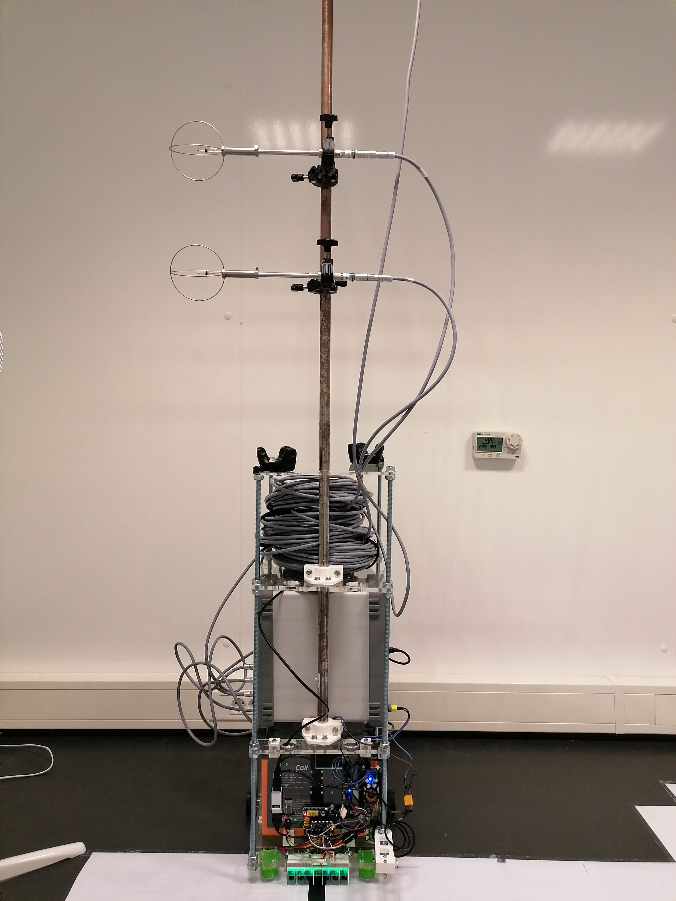

# Milou: a low-cost open-source line-following robot to study indoor air

Milou is a low-cost line-following robot that automates indoor measurements with low interference. She follows a line and stops at sampling points to measure.
This repository contains the blueprints to build Milou, the code to run and operate it, and the code to post-process the data from a measurement campaign that we did.

This repository accompanies the paper [Milou: a low-cost open-source line-following robot to study indoor air](TO BE PUBLISHED).

## Description of directories

1. `building_milou`: contains the drawings to laser cut and 3d print all parts of Milou in `drawings`, the Arduino code needed to run Milou in `milou_line_following`, and the code needed to connect Milou to a computer remotely in `rp_to_mu_connection`.
2. `postprocessing`: contains three Python files that use data from [4TU?]. requirements.txt contains the dependencies to run the python code.

## Parts
The following is a list of all the parts we used to build Milou.
Equivalent parts are also possible.

| Parts       							| Quantity |
| ----------- 							| ---------|
| Arduino Nano Every					| 1        |
| Raspberry Pi Zero W					| 1        |
| MG996R Servo motors 					| 2        |
| ⌀ 6 mm stainless steel rod (1 m long. Use it to make 2 13 cm shafts from motors to wheels) 		 				| 1        |
| 6 mm to 6 mm coupler 					| 2        |
| Ball bearing (⌀ 6 mm inner and ⌀ 19 mm outer) 					| 2        |
| 50 mm ⌀ Aluminum wheel (we needed two on each side to carry the weight)					| 4        |
| Heavy duty castor balls				| 2        |
| TCRT5000 Tracking Sensor Module 	| 7        |
| 12V LiFePO4 battery (38Ah)			| 1        |
| Switch button							| 1        |
| HC-06 Bluetooth module				| 1        |
| ⌀ 10 mm threaded stainless steel rod (1 m long)| 4        |
| ⌀ 20 mm hollow tube (1.75 m long)		| 1        |
| Step-down converter 12 V to 9V (200W)	| 1        |
| Step-down converter 12 V to 5V (5A)	| 2        |

And a lot of wires, screws, nuts, rings, and spacers.
We also used busbars to distribute the power from the battery to the various components.

The rest of the parts are laser cut or 3d printed (see drawings folder).

Below is the wiring scheme of Milou's electrical components.

## Acknowledgements
We want to acknowledge the following [Instructables](https://www.instructables.com/Line-Follower-Robot-PID-Control-Android-Setup/) post that helped build Milou.
